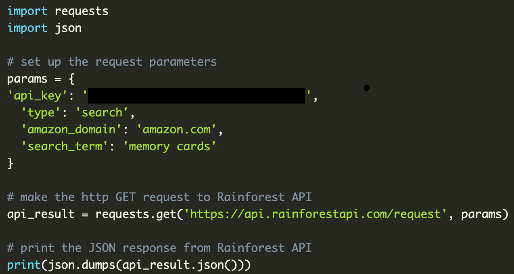
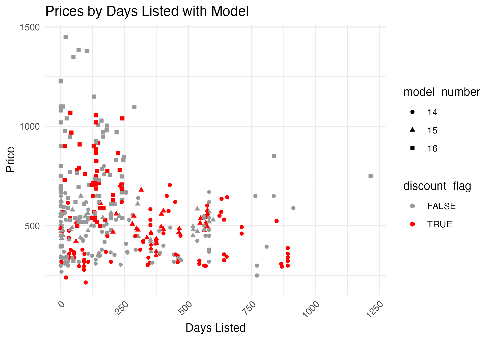

#### eBay API and Data Cleaning

The full code for the API calls and initial data cleaning in Python discussed below is available here(LINK).

For the eBay data, an eBay developer account was created and production application keys were available.  Python was used to code the API call, using the requests and json modules.  After reviewing the , it appeared that the Browse API was the option with the most information available to develop pricing / listing ML models.  This allowed for a keyword search, such as "iPhone 16" and "soccer jerseys." 

The code needed to call the API required a token first before searching.  The following were used 
"https://api.ebay.com/identity/v1/oauth2/token"
"https://api.ebay.com/buy/browse/v1/item_summary/search"

After obtaining the data request, a .json file was created which was then converted to a pandas dataframe.  

Fields were reviewed and then a first round of data cleaning and preparing was done in Python.  It was noted that additional data was contained within the "title" field, which could be beneficial as separate features.  After a cursory review of the data, it was noted that older iPhone models were included in the search; for example, iPhone 5 16GB.  So regex was used to attempt to extract model number from the title and then filter out old models of iPhone.  

Some of the fields were transferred to the dataframe still in a .json format, so these needed to be extracted as well, such as cateogry ID, name and shipping cost.  The *item original date* field was used to add a calculated field considering total days listed, using today's date.  Certain fields were then selected for the final dataframe to be used in analysis and were then exported to .csv.  This was done in order to import into an R program for exploratory data analysis, which will be discussed below.

Similarly to the iPhone data, the soccer jerseys .json was converted to a pandas dataframe and additional information was considered.  Various clubs and countries were noted in the titles, which were attempted to be extracted via regex and Rapidfuzz (used for fuzzy matching).  Another calculated field was added, which summed up the number of listings that specific sellers had open, as a potential feature in modeling to predict price and/or competitive listings.  

#### Amazon API and Data Cleaning

For the Amazon data,  was used.

The specific code allowed for a general search of products, such as microwaves and Lego, which were done separately and saved as .json files.  These were then converted to pandas dataframes and additional cleaning similar to the eBay data was performed. Some fields of interest are recent sales, sponsored items, list price (to calculate discounts), and ratings.  The goal is to see if these fields are sufficient to predict prices and identify "good deals" and competitive listings using various machine learning models.  The Rainforest API free tier is limited and thus additional searches may not be available without upgrading the account.  

#### Exploratory Data Analysis

The full code and data files for the exploratory data analysis are available here(LINK).

The inital data exploratory analysis was performed in R, using ggplot and tidyverse.  

First, the a simple iPhone data histogram was created.

From here, it is noted that there are cell phone accessories included in the search.  The data contains a cateogry ID, so this was used to filter the data as *iPhones only*.

A histogram of phones by price, further segemented by condition, was prepared.  

From this, it can be seen that a number of phones were less than $100, which appears abnormal.  Upon review of items' descriptions, these were accessories that were incorrectly given a category ID of "cell phone."  So, these items were removed from the data.  

Then, a scatter plot of phones using price vs days listed was created, which an additional flag of "discount" used to highlight items that were marked down from their original price.

From the original data cleaning in Python, older models such as iPhone 5/6 were removed.  Models 14 and above were kept; although the search was for iPhone 16, it was thought that the model number could be used as a feature and thus was considered.  From here, it can be seen that there are a few older items listed as iPhone 16, which is not realistic as the iPhone 16 was released in September 2024. These items will be investigated for possible removal from the data set.

Condition (i.e. New vs. Used) was an available field and used to visualize average prices.

Condition would appear to be a natural feature in price prediction.

Condition and days listed could be of interest.

For the soccer jerseys, similar EDA was performed.  Top clubs, e.g. Liverpool or Real Madrid, were identified by the user based on simple internet search (of course, there is some subjectivity with this).  From a simple box plot, it would appear that jerseys from top clubs do tend to be priced higher.  

For the Amazon data, different fields are available, including ratings, sponsored (yes/no), and recent sales, although granular data for this isn't available (only 5K+ / 10K+, for example).  

Of interest could be if sponsored listings and ratings are correlated with sales quantity.

It's unclear how "recent" the sales figures are from, but it appears there could be outliers in this dataset with items with fewer recent sales but significant ratings.

#### Summary
After cursory review of the data once converted to a pandas dataframe, a number of cleaning and preparing tasks were completed including extracting relevant data embedded within the "title" field and calculating additional fields based on the available data, like days-on-hand.

Once the data was availble to be fully visualized, additional cleaning was necessary to adjust for mis-classification of categories.  The visualizations then allow for the user to formulate questions on correlations and feature selection for use in machine learning models.   

